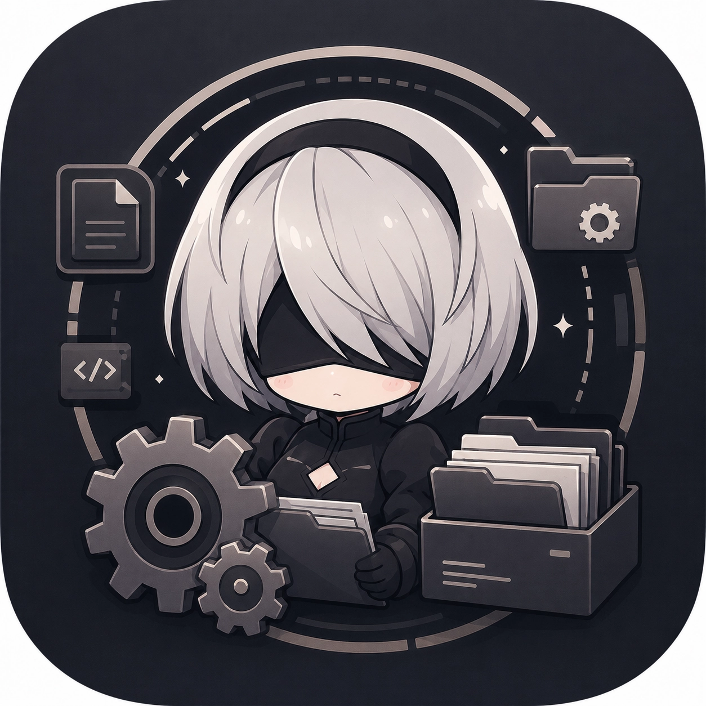

<div align="center">
  
  <h1 align="center">WuWaConfig</h1>
  <p align="center">
    <strong>Wuthering Waves Android Config Toolkit</strong>
    <br />
    FPS boost · Graphics tuning · Smart Auto-optimization · Pity Tracker · Battle Stats
  </p>
  <p>
    <a href="https://github.com/B3rr7/WuWa-Config-Android/releases"></a>
    <a href="https://github.com/B3rr7/WuWa-Config-Android/releases"></a>
    <a href="https://github.com/B3rr7/WuWa-Config-Android/blob/main/LICENSE"></a>
    <br />
    <a href="https://github.com/B3rr7/WuWa-Config-Android/actions"></a>
    <a href="https://github.com/B3rr7/WuWa-Config-Android/stargazers"></a>
    <a href="https://t.me/Yt_Player42"></a>
    <a href="https://discord.gg/5WP9nN2e2s"></a>
    <a href="https://www.youtube.com/@Player42_g"></a>
  </p>
</div>

<br />

> **⚠️ DISCLAIMER** This project is **NOT affiliated with Kuro Games or Wuthering Waves**. Fan-made tool for editing game configuration files. Modifying game files may be subject to the game's Terms of Service. **Use at your own risk.**

---

## ✨ Features at a Glance

| Category | Feature |
|----------|---------|
| 🚀 **FPS Boost** | 5 presets (Potato → Ultra), 120 FPS unlock, Vulkan toggle, thermal throttling fixes |
| 🧠 **Smart Auto-Optimize** | Analyzes device (GPU/RAM/FPS/thermal), scores 0-100, recommends best preset |
| ⚡ **Auto-Tune Wizard** | Multi-round benchmark → deploy → test → adjust → repeat until target FPS hit |
| 🎨 **Graphics Tuning** | Shadow quality, SSR, bloom, fog, CA, outlines, radial blur, HZB occlusion, texture streaming |
| 🔍 **CVar Editor** | Full INI editor with auto-sync, hash reconciliation, 3100+ CVar database reference |
| 💾 **Backup & Restore** | Per-file selection, auto-backup before deploy with scope dialog |
| 🔗 **4 Access Methods** | ADB (in-app), Shizuku, Root, SAF — no PC needed |
| 📊 **Pity Tracker** | Fetches gacha history from Kuro's API, calculates soft/hard pity, 50/50 status |
| 📈 **Battle Stats** | Combat analytics from Client.log: dodges, deaths, echo skills, stamina, teleports |
| 👤 **Player Profile** | UID, server, tower floor, rogue score, battle pass status, config summary |
| 🔐 **Undetectable** | Adaptive hash patching preserves ModifyCount, unknown fields, formatting. Snapshot+reconcile detects game interference |
| 📁 **Public Storage** | All files saved to `Downloads/WuWaConfig/` — accessible from any file manager |

---

## 📲 Installation

```
1. Download latest .apk from Releases
2. Install (enable "Unknown sources")
3. Accept Terms
4. Grant storage permission
5. Connect via ADB / Shizuku / Root / SAF
```

<div align="center">
  <a href="https://github.com/B3rr7/WuWa-Config-Android/releases"></a>
</div>

---

## 🔌 Access Methods

### 🔧 ADB (Wireless Debugging) — *No Root*
App implements the ADB wire protocol directly — no external ADB binary.

> **Setup:** Enable Wireless Debugging → tap Connect → accept RSA fingerprint

### 📱 Shizuku — *No Root*
Uses Shizuku API via reflection for elevated shell access.

> **Setup:** Install [Shizuku](https://shizuku.rikka.app/) → start service → select Shizuku → Permit → Connect

### 🦸 Root — *Full Access*
Direct `su -c` shell via ProcessBuilder.

> **Setup:** Select Root → Test Root → grant in root manager → Connect

### 📂 SAF — *No Shell, No Generator*
Storage Access Framework — read/write only. Best for quick one-off INI edits.

> **Setup:** Select SAF → Pick Dir → navigate to game config folder → Allow

---

## 🧠 Smart Brain Scoring

Analyzes device from `Client.log` and scores each preset 0-100:

| Signal | Impact |
|--------|--------|
| 🖥 GPU tier | ±30 |
| 💾 RAM | ±15 |
| ⚡ Vulkan | +8 |
| 📉 FPS drops | −6 to −18 |
| 🌡 Thermal events | −5 to −20 |
| 💥 GPU OOM | −12 to −30 |
| 🔄 Frame drops | −5 to −10 |
| 🚫 Forbidden CVars | −5 each (toggle off) |
| ✅ Active optimization | +5 optimized / −8 room to improve |

**Recommended preset:** Ultra (≥80), High (≥70), Balanced (≥40), Performance (<40), Potato (≤20 or OOM)

---

## 🎮 Presets

| Preset | Screen% | Shadow | SSR | View Dist | Foliage LOD |
|--------|---------|--------|-----|-----------|-------------|
| 🥔 **POTATO** | 50% | Off (128) | Off | 0.3 | 0.4 |
| ⚡ **PERFORMANCE** | 60% | Off | Off | 0.5 | 0.7 |
| ⚖️ **BALANCED** | 80% | Medium | Low | 1.5 | 2.0 |
| 🔥 **HIGH** | 100% | High | High | 2.0 | 2.5 |
| 💎 **ULTRA** | 100% | Epic | Ultra | 3.0 | 3.0 |

---

## 🔬 CVar Database

3 reference files extracted directly from the game binary:

| File | Lines | Source |
|------|-------|--------|
| `libUE4_cvars.txt` | ~3100 | All CVars from `libUE4.so` UTF-16 strings |
| `config_monitor_cvars.txt` | 569 | CVars KuroConfigMonitor tracks |
| `config_monitor_values.txt` | 568 | Game default values for monitored CVars |

The generator cross-references against these to:
- ✅ Comment out redundant CVars matching defaults (`; REDUNDANT`)
- ⚠️ Flag unknown CVars not in UE4 binary (`; UNKNOWN CVar`)
- 🎯 Only deploy CVars that actually affect the engine

**33 forbidden CVars** are stripped automatically (game ignores them anyway).

---

## 🛡 Detection Avoidance

| Mechanism | How it works |
|-----------|-------------|
| **Adaptive hash patching** | Reads existing `KuroConfigMonitor.hash`, patches only `Hash=` & `LastModifiedTime=`, preserves `ModifyCount=`, unknown fields, formatting |
| **Atomic write** | Writes to `.new` temp → `mv` rename — crash never corrupts live file |
| **Zero stale temps** | `rm -f /data/local/tmp/wuwaconfig_*.b64` before every push |
| **ModifyCount preserved** | Never incremented — no cumulative trail from testing |
| **Snapshot + Reconcile** | Every config op captures pre-hash → compares → detects game interference |
| **Auto-sync** | On connect and INI Editor open, auto-checks/fixes hash desync |

---

## 📂 Project Structure

```
com.wuwaconfig.app/
├── WuWaConfigApp.kt          # Application singleton, backend holder
├── MainActivity.kt           # NavHost (14 routes), permissions
├── adb/                      # Custom ADB wire protocol (4 files)
│   ├── AdbProtocol.kt        # Binary message framing (CNXN/OPEN/WRTE/AUTH)
│   ├── AdbClient.kt          # TCP socket, RSA auth, shell exec
│   ├── AdbCrypto.kt          # 2048-bit RSA key management
│   └── PortScanner.kt        # ADB port discovery (37000-44000)
├── backend/                  # 4 AccessBackend implementations
│   ├── AdbBackend.kt         # Wireless ADB (base64 chunk push)
│   ├── ShizukuBackend.kt     # Shizuku API via reflection
│   ├── RootBackend.kt        # su -c shell
│   └── SafBackend.kt         # Storage Access Framework
├── config/                   # Core logic (14 files, ~4900 lines)
│   ├── ConfigGenerator.kt    # INI generation engine (1515 lines)
│   ├── ConfigManager.kt      # Device I/O, hashes, backups (1057 lines)
│   ├── CvarDatabase.kt       # 3 CVar reference files from assets
│   ├── CvarCategorizer.kt    # Pure CVar classification (18 categories)
│   ├── CvarOptimizer.kt      # Per-device profile optimizer
│   ├── SmartBrain.kt         # Scoring engine (0-100)
│   ├── BenchmarkTuner.kt     # Auto-tune state machine
│   ├── LogParser.kt          # XOR decryption + log analysis
│   ├── GachaApi.kt           # Kuro gacha API HTTP client
│   ├── ForbiddenCvars.kt     # 33 forbidden CVars
│   └── ...stores & utilities
├── model/                    # 12 data classes
├── service/                  # Foreground services (ADB, GachaPoll)
└── ui/                       # Compose UI (13 screens)
    ├── MainViewModel.kt      # Single ViewModel (~1395 lines)
    ├── components/            # GlassCard, GlitchText, etc.
    ├── screens/               # 13 screens
    └── theme/                 # Neon colors, dark/light themes
```

---

## 🛠 Tech Stack

| Layer | Technology |
|-------|-----------|
| **Language** | Kotlin 1.9.22 |
| **UI** | Jetpack Compose + Material 3 |
| **Architecture** | MVVM (single ViewModel + StateFlow) |
| **Navigation** | Jetpack Navigation Compose |
| **Image loading** | Coil |
| **Video playback** | Media3 ExoPlayer |
| **Serialization** | Gson |
| **Build** | Gradle + AGP 8.2.2 |
| **Min SDK / Target** | 26 / 34 |
| **ADB protocol** | In-app (no external binary) |

---

## 🔗 Links

| | |
|---|-----|
|  **Source** | [github.com/B3rr7/WuWa-Config-Android](https://github.com/B3rr7/WuWa-Config-Android) |
|  **YouTube** | [@Player42_g](https://www.youtube.com/@Player42_g) |
| ✈️ **Telegram** | [t.me/Yt_Player42](https://t.me/Yt_Player42) |
| 🎮 **Discord** | [discord.gg/5WP9nN2e2s](https://discord.gg/5WP9nN2e2s) |

---

## 🏷 Topics

`wuthering-waves` `wuwa` `android` `fps-boost` `engine-ini` `config-optimizer` `gacha-tracker` `pity-calculator` `kuro-games` `mobile-gaming` `performance` `android-optimization` `ue4` `unreal-engine-4` `adb` `shizuku` `gaming-tool` `fps-unlock` `graphics-tuning` `cvars-editor` `client-log-analyzer` `mobile-game-booster` `gacha-history` `open-world-mobile` `thermal-fix` `low-end-booster` `auto-tune` `fps-benchmark` `snapdragon-gaming` `adreno-tuning` `mali-gpu-config` `vulkan-optimization`

---

<div align="center">
  <sub>Built with ❤️ by <a href="https://github.com/B3rr7">Player42</a></sub>
  <br />
  <sub>Copyright © 2026 Player42 — <a href="LICENSE">MIT License</a></sub>
</div>
