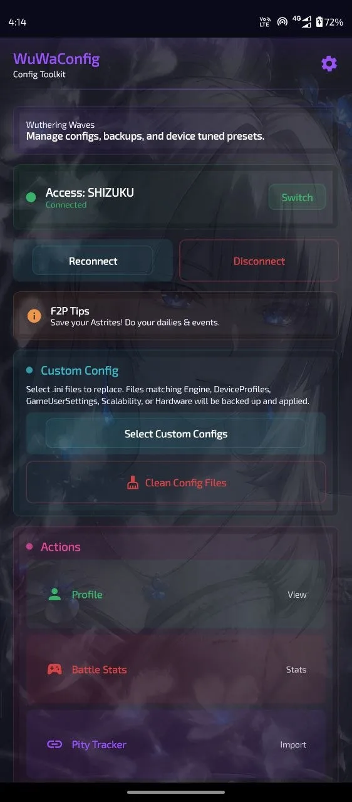
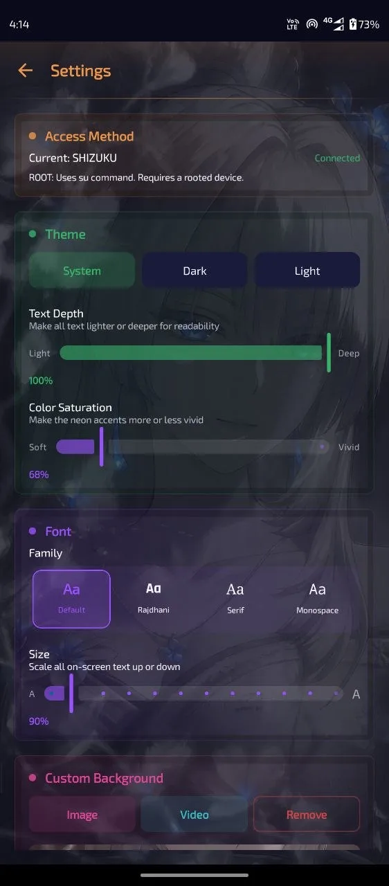
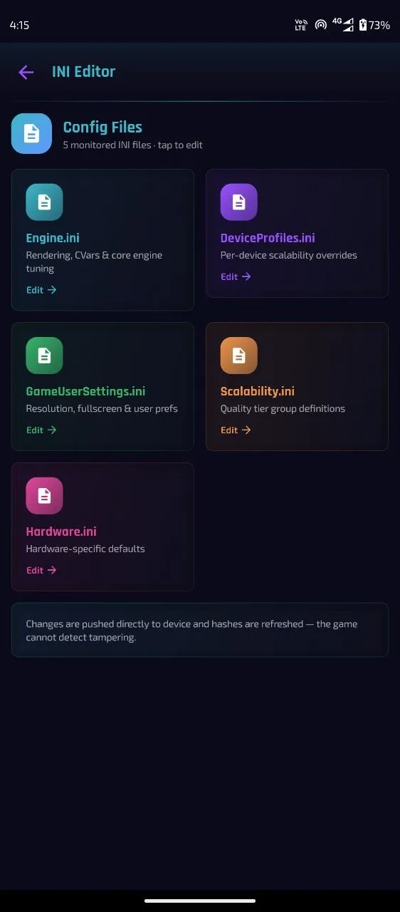
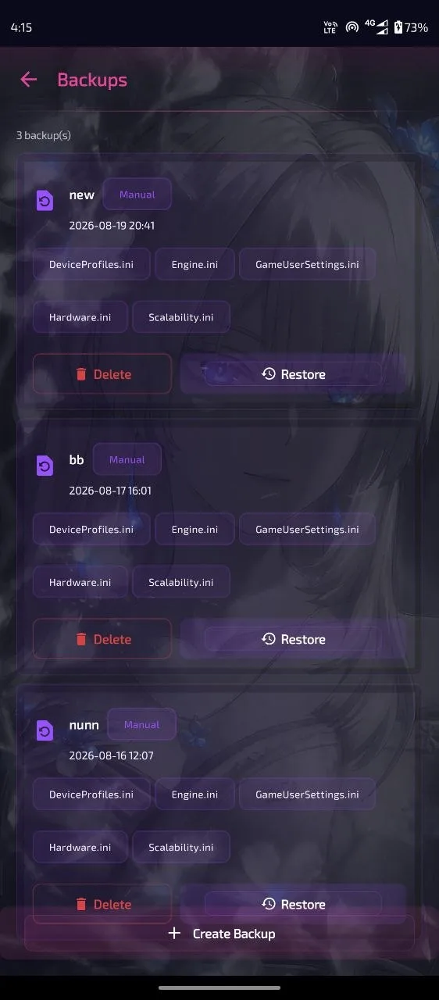
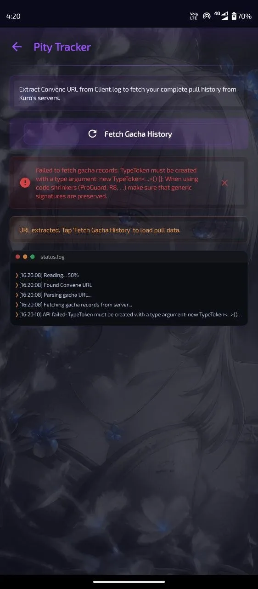
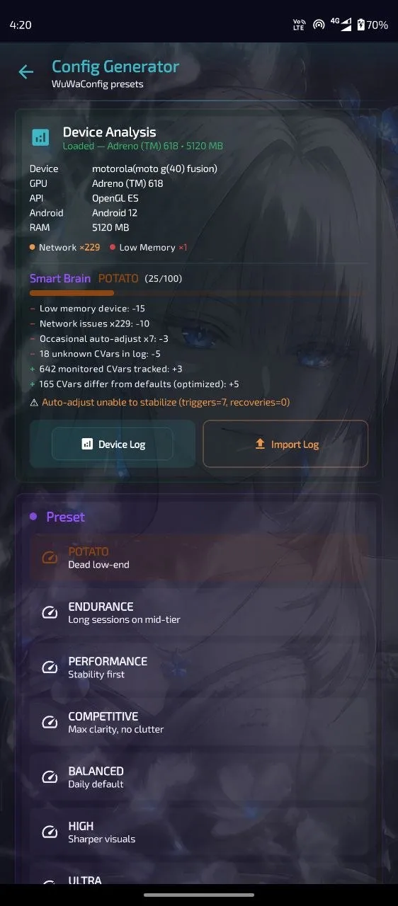

<div align="center">

# 🎮 WuWaConfig — Wuthering Waves Config Toolkit & FPS Booster for Android

[](https://github.com/B3rr7/WuWa-Config-Android/releases)
[](https://github.com/B3rr7/WuWa-Config-Android/stargazers)
[](https://github.com/B3rr7/WuWa-Config-Android/network/members)
[](https://github.com/B3rr7/WuWa-Config-Android/issues)
[](https://github.com/B3rr7/WuWa-Config-Android/blob/main/LICENSE)
[](https://github.com/B3rr7/WuWa-Config-Android)
[](https://kotlinlang.org)
[](https://developer.android.com/jetpack/compose)
[](https://github.com/B3rr7/WuWa-Config-Android)

**Boost FPS · Tune Graphics · Analyze Device · Track Pity · Stay Private**

*The free, open-source Android toolkit to optimize Wuthering Waves (UE4) — generate Engine.ini, Scalability.ini, GameUserSettings.ini, DeviceProfiles.ini & Hardware.ini tuned to your Snapdragon / Dimensity / Exynos / Tensor hardware. Works without root via ADB, Shizuku, or SAF.*

[📥 Download APK](https://github.com/B3rr7/WuWa-Config-Android/releases) · [🌐 Website](https://b3rr7.github.io/WuWa-Config-Android/) · [💬 Discord](https://discord.gg/5WP9nN2e2s) · [📹 YouTube](https://www.youtube.com/@Player42_g)

</div>

---

> **SEO Summary:** WuWaConfig is a free Android app to boost Wuthering Waves FPS and optimize graphics. Fix FPS drops, thermal throttling, GPU OOM, missing textures, and stuttering with SmartBrain device scoring (0–100). Generates Engine.ini, Scalability.ini, GameUserSettings.ini, DeviceProfiles.ini & Hardware.ini tuned to Snapdragon, Adreno, Dimensity, Mali, Exynos, Tensor, Kirin hardware. 5,885 CVars across 8 presets, 120 FPS unlock, gacha pity tracker, battle stats analyzer, CVar editor, deploy via ADB wireless debugging, Shizuku, Root or SAF. Zero telemetry.

> [!WARNING]
> **DISCLAIMER** — This project is **NOT affiliated with Kuro Games or Wuthering Waves**. Fan-made tool for editing game configuration files. Modifying game files may be subject to the game's Terms of Service. **Use at your own risk.**

> [!NOTE]
> **PLATFORM** — Android 8.0+ (API 26) only. Not available for iPhone/iPad. Windows/macOS/Linux require an Android device or emulator.

> **🔧 Troubleshooting Keywords:** wuthering waves fps drop fix, thermal throttling fix android, gpu oom fix mobile, texture error fix wuwa, 120 fps unlock not working, exynos mali performance fix, low end phone fps boost, frame pacing fix, post processing artifacts, stuttering fix wuthering waves, render scale optimization, shadow quality optimization, foliage density fix, anisotropic filter fix, mip bias fix, texture streaming fix, adb deploy permission denied, scoped storage fix android, ue4 config optimizer, engine.ini generator, scalability.ini tune, gameusersettings.ini fix, deviceprofiles.ini setup, hardware.ini config, resolution scale fix, vulkan robust buffer access fix, hzb occlusion enable, frame pace maxfps set, r.Streaming.MipBias tune, r.FoliageLODDistanceScale adjust, r.MaxAnisotropy set, r.HZBOcclusion enable, r.ForwardShading fix, r.SkinCache.CompileShaders, r.RayTracing.LimitDevice off, post process quality low, bloom value reduce, auto exposure disable, volumetric fog disable, reflection environment zero, dynamic lights off, texture pool size reduce, anisotropic filter reduce, shadow max resolution lower, mobile shadow quality low, fps cap unlock 120, wireless debugging setup, shizuku deploy fix, root config deploy, saf storage access setup, chinese rom permission denied fix, xiaomi hyperos adb fix, kuro games config tool, wuwa performance optimizer, mobile gaming optimization, snapdragon adreno tuning, dimensity mali config, tensor gpu optimization, low end gaming boost, android fps booster, wuthering waves graphics settings, wuwa engine ini editor, wuwa config generator apk, wuthering waves pity tracker, wuwa battle stats analyzer, wuwa client log parser, wuwa cvar database editor, wuwa gacha tracker app, wuwa player profile viewer, wuwa backup restore tool, wuwa hash monitor deploy, wuwa ini editor tool, wuwa log viewer, wuwa deploy history, wuwa verify deployed cvars, wuwa forbidden cvars strip, wuwa cvar categorizer, wuwa smart brain scoring, wuwa preset potato cinematic, wuwa vulkan optimization, wuwa force opengl mobile, wuwa fullscreen mode fix, wuwa resolution quality split, wuwa windowed viewport bug, wuwa kuro render quality, wuwa scalability sections, wuwa hardware.ini chipset, wuwa game mode overworld, wuwa tower of adversity, wuwa 11 pool gacha, wuwa soft pity 66, wuwa guaranteed 50 50, wuwa pull history, wuwa result history, wuwa char card, wuwa weapon card, wuwa banner tracker, wuwa pity calculator android, wuwa gacha history store, wuwa convene url parse, wuwa battle stats dd decrypt, wuwa xor lut decrypt, wuwa client log read, wuwa player profile uid, wuwa game progress tower, wuwa weekly rogue, wuwa battle pass, wuwa config generator presets, wuwa generator options, wuwa game paths, wuwa config hash, wuwa verification report, wuwa atomic file write, wuwa deploy retry, wuwa port scanner adb, wuwa adb crypto rsa, wuwa shell utils shquote, wuwa adb protocol wire, wuwa port scan fix, wuwa adb connection service, wuwa shell user service, wuwa adb backend run as, wuwa shizuku backend deploy, wuwa root backend su, wuwa saf backend documentfile, wuwa tree device root, wuwa persistable tree uri, wuwa access method switch, wuwa backend status check, wuwa adb wireless debugging, wuwa adb tcpip 5555, wuwa adb connect device, wuwa adb disconnect, wuwa adb multi device, wuwa adb usb debug security, wuwa permission denied fix, wuwa run as game package, wuwa android data scoped, wuwa chinese rom hyperos, wuwa xiaomi adb fix, wuwa shizuku permission permit, wuwa shizuku user service, wuwa rikka shizuku keep, wuwa shizuku provider exported, wuwa root magisk kernel su, wuwa apatch root, wuwa saf picker initial uri, wuwa document file path, wuwa tree device root derive, wuwa scoped storage deny, wuwa shell user blocked, wuwa run as fallback, wuwa cp based copy, wuwa push retry count, wuwa max arg str len, wuwa base64 chunk push, wuwa md5 verify push, wuwa adb port scan, wuwa adb so timeout fix, wuwa drain trailing write, wuwa pipe race fix, wuwa adb keepalive heartbeat, wuwa adb generation guard, wuwa tx mutex contention, wuwa coroutine scope churn, wuwa semaphore port scan, wuwa limited parallelism, wuwa async collect state, wuwa collect as state lifecycle, wuwa remember async painter, wuwa disposable effect lifecycle, wuwa video background exoplayer, wuwa neon saturation launched effect, wuwa color neon cyan, wuwa theme material dark light, wuwa compose compiler version, wuwa kotlin compiler extension, wuwa gradle catalog version, wuwa ktlint check format, wuwa unit test debug, wuwa assemble debug apk, wuwa assemble release signing, wuwa keystore properties, wuwa release jks fallback, wuwa proguard keep rules, wuwa allow backup false, wuwa network security config, wuwa encrypted file android keystore, wuwa local broadcast manager, wuwa gacha network cleartext, wuwa no telemetry privacy, wuwa security privacy android, wuwa gitignore keystore, wuwa build quirks release, wuwa off cache gradle lint, wuwa offline debug build, wuwa clean assemble debug, wuwa gradle 8.6 jdk 17, wuwa agp 8.4.2, wuwa kotlin 1.9.24, wuwa compose bom 2024.10, wuwa min sdk 26 target 34, wuwa app module single, wuwa 78 kotlin files, wuwa 21342 lines code, wuwa version 1.1.5 code 16, wuwa mvvm architecture, wuwa viewmodel stateflow, wuwa nav compose routes, wuwa main activity single, wuwa wu wac config app, wu wa config application, wuwa config generator preset, wuwa cvar database load, wuwa cvar categorize android, wuwa forbidden cvars strip, wuwa config optimizer smart brain, wuwa log parser decrypt, wuwa profile extractor parallel, wuwa hash monitor atomic, wuwa backup store restore, wuwa deploy history store, wuwa gacha history store, wuwa profile store, wuwa log repository fan, wuwa battle stats store, wuwa log analysis store, wuwa benchmark tuner, wuwa chipset detector, wuwa config manager facade, wuwa config gen util, wuwa ini hash util, wuwa hash sync, wuwa line diff compute, wuwa atomic file write, wuwa shell utils compute md5, wuwa access backend interface, wuwa backend access method, wuwa backend status data, wuwa adb protocol header, wuwa adb client tcp auth, wuwa adb crypto rsa encrypt, wuwa port scanner batch, wuwa adb connection foreground, wuwa shell user binder, wuwa adb backend push, wuwa shizuku backend user service, wuwa root backend su c, wuwa saf backend document file, wuwa shell utils sh quote, wuwa config generator generate, wuwa cvar database optimize, wuwa cvar categorizer match, wuwa forbidden cvars list, wuwa cvar optimizer tier, wuwa smart brain score, wuwa config gen util dedupe, wuwa log parser parse, wuwa profile extractor read, wuwa hash monitor refresh, wuwa backup store create, wuwa deploy history add, wuwa gacha history fetch, wuwa profile store save, wuwa log repository add, wuwa battle stats plus, wuwa log analysis cache, wuwa benchmark tuner state, wuwa chipset detect chip, wuwa config manager deploy, wuwa config gen util override, wuwa ini hash util md5, wuwa hash sync snapshot, wuwa line diff diff, wuwa atomic file commit, wuwa shell utils max push, wuwa access backend switch, wuwa adb protocol encode, wuwa adb client drain, wuwa adb crypto key, wuwa port scanner ip cache, wuwa adb connection bind, wuwa shell user start, wuwa adb backend verify, wuwa shizuku backend script, wuwa root backend timeout, wuwa saf backend tree, wuwa shell utils retry

---

## 📚 Interactive Table of Contents

<details open>
<summary><b>Click to expand / collapse</b></summary>

1. [✨ Why WuWaConfig?](#-why-wuwaconfig)
2. [⚡ Quick Start](#-quick-start)
   - [For Players (Install APK)](#for-players-install-apk)
   - [For Developers (Build from Source)](#for-developers-build-from-source)
   - [One-Line Verification](#one-line-verification)
3. [✨ Feature Breakdown](#-feature-breakdown)
   - [FPS Booster & Config Generator](#1-fps-booster--config-generator-8-presets--smartbrain)
   - [SmartBrain Device Scoring (0–100)](#2-smartbrain-device-scoring-0100)
   - [CVar Database & Optimizer](#3-cvar-database--optimizer-5889-entries)
   - [Gacha Pity Tracker](#4-gacha-pity-tracker-1150-cap)
   - [Battle Stats Analyzer](#5-battle-stats-analyzer)
   - [Player Profile](#6-player-profile-read-only)
   - [Backup, Restore & Hash Monitor](#7-backup-restore--hash-monitor)
   - [INI Editor & Log Tools](#8-ini-editor--log-tools)
4. [🔌 Access Methods](#-access-methods-how-to-connect)
5. [🖥️ Screens Walkthrough](#️-screens-walkthrough)
6. [🗂️ Folder Map — Repository Structure](#️-folder-map--repository-structure)
7. [🏗️ Architecture (MVVM)](#️-architecture-mvvm)
8. [🛠️ Tech Stack](#️-tech-stack)
9. [🧪 Testing & Code Quality](#-testing--code-quality)
10. [🔒 Privacy & Security](#-privacy--security)
11. [🤝 Community & Contributing](#-community--contributing)
12. [🔑 Keywords & SEO](#-keywords--seo)
13. [📄 License](#-license)

</details>

---

## 🌟 Why WuWaConfig?

| | |
|---|---|
| 🚀 **True FPS Boost** | Generates 5 tuned INIs — `Engine.ini`, `Scalability.ini`, `GameUserSettings.ini`, `DeviceProfiles.ini`, `Hardware.ini`. `FullscreenMode=0` + `sg.ResolutionQuality` split fixes Android windowed viewport bug |
| 🧠 **SmartBrain 0–100** | Scores GPU tier, RAM, Vulkan, thermal, OOM, FPS drops — auto-recommends Potato → Cinematic. Fix FPS drops (signal −6/−18), thermal throttling (−5/−20), GPU OOM (−12/−30), low-memory (−15) |
| 🎚️ **8 Presets, No Dead Fields** | Each tier sets `screen%`, `shadow`, `shadowRes`, `ssr`, `mipbias`, `streaming`, `viewDistance`, `foliage LOD`, `lod_bias`, `grasscull`, `characterDetail`, `postProcess`, `staticLighting`, `cutsceneQuality` |
| 🔧 **CVarDB 5,885 Entries** | `optimizeIniText()` comments redundant/unknown with `; [CvarDB]`. `ForbiddenCvars` (31) stripping. `CvarCategorizer` 3-level match, 18 categories |
| 🔮 **Pity Tracker 11 Pools** | No 50-pull cap. Soft-pity (pull 66+) from ~394K-sample. `Guaranteed` vs `50/50` per banner |
| ⚔️ **Battle Stats** | `dd` partition XOR-LUT decrypt (`LUT(b)=b xor 0x4A`), UTF-16/8, 5 cards: Combat / Exploration / Economy / Social / System |
| 💾 **Safe Deploy** | Per-file backup, hash snapshot+reconcile (`ModifyCount` cap 8, atomic `.new`+`mv`), one-tap restore, `verifyDeployedCvars` |
| 🔒 **Private** | Zero telemetry. `allowBackup=false`. ADB keys `EncryptedFile`+`AndroidKeyStore`. `LocalBroadcastManager` for gacha. `network_security_config` cleartext only to `127.0.0.1` |

### 🔧 Quick Troubleshooting Reference

| Symptom | Fix | Preset |
|---|---|---|
| FPS drops below target | Lower Screen% to 60–80%, Shadow 0–2, check `r.FramePace.MaxFPS` | Balanced / Competitive |
| Thermal throttling | `ReflectionEnvironment=0`, all dynamic lights=0, disable volumetric fog, `AutoCool` ON | Potato / Endurance |
| GPU OOM out of memory | `Shadow MaxResolution`→1024, `Anisotropy`→4, `PoolSize`→512, disable HD packs | Potato |
| Missing / broken textures | Enable `r.HZBOcclusion=1`, `MipMapLodBias`→0–1, raise `PoolSize`, verify DeviceProfile | Any + HZB |
| Stuttering / uneven pacing | Lower render scale if CPU-bound, disable VSync, enable `RHICmd` bypass, set `MaxFPS`=60/120 | Any + RHICmd |
| Exynos / Mali underperforming | Start one tier below Snapdragon equivalent, lower shadow & streaming | Competitive / Balanced |
| 120 FPS not unlocking | Enable 120 FPS toggle, check `r.FramePace.MaxFPS=120`, ensure thermal headroom | Flagships only |
| Post-processing artifacts | `PostProcessQuality`→0–2, `Bloom`→0–1, disable auto-exposure, reduce radial blur | Competitive+ |
| Slow deploy / Permission denied | Use `run-as` fallback (Shizuku/ADB), switch to SAF for scoped storage, Root | N/A |

---

## ⚡ Quick Start

### For Players (Install APK)

```bash
# 1. Download latest APK
open https://github.com/B3rr7/WuWa-Config-Android/releases

# 2. Install on Android 8.0+ (allow "Install unknown apps")
# 3. Open → Accept Terms → Grant Storage permission → Connect (see Access Methods)
```

### For Developers (Build from Source)

```bash
# Prerequisites: JDK 17, Android SDK 34, Git
git clone https://github.com/B3rr7/WuWa-Config-Android.git
cd WuWa-Config-Android

# Lint (style is load-bearing — CI gates on ktlint)
./gradlew ktlintCheck          # check
./gradlew ktlintFormat         # auto-fix

# Tests (JUnit 4 + Mockito, 14 pure-logic files, no instrumentation)
./gradlew testDebugUnitTest
./gradlew testDebugUnitTest --tests "com.wuwaconfig.app.config.CvarCategorizerTest"
./gradlew testDebugUnitTest --tests "com.wuwaconfig.app.config.*"

# Build APKs
./gradlew assembleDebug        # → app/build/outputs/apk/debug/WuWaConfig-debug.apk (offline)
./gradlew assembleRelease      # → WuWaConfig-v1.1.5-release.apk (needs keystore.properties + network once for lint-gradle:31.4.2)

# Install to device
adb install -r app/build/outputs/apk/debug/WuWaConfig-debug.apk

# Clean build
./gradlew clean assembleDebug
```

### One-Line Verification

```bash
./gradlew ktlintCheck && ./gradlew testDebugUnitTest && ./gradlew assembleDebug
```

> APK names are hardcoded in `app/build.gradle.kts`: debug `WuWaConfig-debug.apk`, release `WuWaConfig-v{versionName}-release.apk`. Root `WuWaConfig-debug.apk` is a stale manual copy — rebuild.

---

## ✨ Feature Breakdown

### 1. FPS Booster & Config Generator (8 Presets + SmartBrain)

`config/ConfigGenerator.kt: generateWithCorePaths()` builds 5 INIs, merges log CVars, runs `CvarDatabase.optimizeIniText()` (`; [CvarDB] <reason>`), strips `ForbiddenCvars` when `allowRestrictedCvars==false`.

| Preset | Detail | Screen% | Shadow | ShadowRes | SSR | MipBias | Streaming | ViewDist | Foliage LOD | LOD Bias | GrassCull |
|--------|--------|---------|--------|-----------|-----|---------|-----------|----------|-------------|----------|-----------|
| **POTATO** | 0 | 50% | 0 | 128 | 0 | 3 | 0.3× | 0.3 | 0.4 | 5 | 1,500 |
| **ENDURANCE** | 1 | 55% | 0 | 128 | 0 | 3 | 0.4× | 0.4 | 0.5 | 4 | 2,500 |
| **PERFORMANCE** | 2 | 60% | 0 | 256 | 0 | 3 | 0.5× | 0.5 | 0.6 | 3 | 4,500 |
| **COMPETITIVE** | 3 | 100% | 0 | 256 | 0 | 1 | 1.0× | 2.0 | 1.0 | 1 | 2,000 |
| **BALANCED** | 4 | 80% | 2 | 1,024 | 1 | 0 | 2.0× | 1.5 | 2.0 | 0 | 15,000 |
| **HIGH** | 5 | 100% | 4 | 2,048 | 2 | 0 | 3.0× | 2.0 | 2.5 | 0 | 20,000 |
| **ULTRA** | 6 | 100% | 5 | 2,048 | 4 | -1 | 4.0× | 3.0 | 3.0 | -1 | 30,000 |
| **CINEMATIC** | 7 | 100% | 5 | 4,096 | 4 | -2 | 6.0× | 4.0 | 4.0 | -2 | 40,000 |

*Tier-scoped quality fields:* `characterDetail` (0–3 → `r.KuroMaterialQualityLevel`), `postProcess` (0–3 → `sg.PostProcessQuality`), `staticLighting` (bool → `r.AllowStaticLighting`), `cutsceneQuality` (0–3 → `r.Kuro.Movie.EnableCGMovieRendering`). `vulkan`/force-OpenGL is a **global** `GeneratorOptions` toggle (not tiered) — deliberately avoids broken combos. Potato/Performance add HZB forced on, `ReflectionEnvironment=0`, `DistanceFieldShadowing=0`, aggressive LOD culling. See `docs/CONFIG-GENERATOR.md`.

**Options:** 120 FPS unlock, Ultra quality unlock, VSync, Auto cooling, Force Vulkan, HZB occlusion, Disable fog/CA/outlines/blur/bloom/auto-exposure/SSR, Hardware.ini (`ChipsetDetector`), GameMode `Overworld` / `ToA` (Tower of Adversity).

**Generate → ReviewTune:** monospace editor (`IniEditorScreen` + `LineDiff`/`Hashing.md5Of`), per-file toggle, edit inline, deploy or close. `FullscreenMode=0` avoids Android windowed bottom-left viewport bug; `KuroRenderQuality@0..@3` in Scalability.

### 2. SmartBrain Device Scoring (0–100)

`config/SmartBrain.kt` + `CvarOptimizer.kt` — ~20 signals → `recommendPreset()` (first-match wins top-to-bottom):

| Signal | Impact |
|--------|--------|
| GPU tier (Snapdragon/Adreno, Dimensity/Mali, Exynos, Tensor via `ChipsetDetector`) | +30 to -20 |
| RAM | +8 to -15 |
| Vulkan | +8 |
| FPS drops / frame drops | -6 to -18 / -5 to -10 |
| Thermal throttling | -5 to -20 |
| GPU OOM (`gpuOom ≥2` → `potato`) | -12 to -30 |
| Auto-adjust triggers (>10) | endurance/performance path |
| Forbidden CVars (-5 each, toggleable) | -5 |
| Unknown CVars (>5) | -5 |
| Active CVars vs defaults | +5 or -8 |

**Preset routing:** `potato` if `gpuOom≥2` or low-mem or `≤20`; `cinematic` if `≥85`+Vulkan+flagship+no thermal; `ultra` `≥80`; `high` `≥75/70`+flagship; `competitive` `≥45`+`fpsCap-fpsActual>15`; `balanced` `≥40`; `endurance`/`performance` on thermal/auto-adjust. `HashMonitor`, `ProfileExtractor` (parallelized) and `ConfigGenUtil` feed signals.

### 3. CVar Database & Optimizer (5,889 Entries)

- **Source:** `assets/cvars/libUE4_cvars.txt` (5,889) + `config_monitor_cvars.txt` / `config_monitor_values.txt` (735 each); `*_categorized.txt` mirrors shipped for tooling, not loaded.
- **Runtime:** `CvarDatabase` loads 3 files async in `WuWaConfigApp.onCreate`; `optimizeIniText()` comments redundant/unknown with `; [CvarDB] <reason>` (single tag).
- **Categorization:** `CvarCategorizer` standalone `object`, 3-level matching, 18 categories, Android-free testable.
- **Safety:** `ForbiddenCvars` 31 entries; `stripForbiddenCvars()` when `allowRestrictedCvars==false`; `CvarCategorizerTest`, `CvarDatabaseOptimizeTest`, `ForbiddenCvarsTest` cover it. `LogParser` pre-compiles per-line `Regex` `val`s (hot path `parseLog` cognitive 118, 23 `linear_scan_in_loop` — already hoisted).

### 4. Gacha Pity Tracker (11 Pools, No Cap)

`config/GachaApi.kt` + `GachaHistoryStore` (`gacha_history.json`, 12h TTL) + `GachaViewModel` (cancellable) + `PityScreen`:

- **Fetch:** reads Convene URL from `Client.log` (auto-retries 6×10s — URL appears after opening Convene History in-game), `gmserver-api.aki-game2.com/net` (user-initiated, `network_security_config` allows cleartext only to `127.0.0.1`/`localhost`), 11 pools (Character Event, Weapon Event, Standard, Beginner 1/2 + 3 event rotations), **no truncation**.
- **Pity Overview:** Total Pulls · ★5 · ★4 + Avg ★5/★4 pity.
- **Next ★5 Prediction per pool:** status pill `Guaranteed` (gold) / `50/50` (amber), progress bar with soft-pity zone (amber from pull 66, dataset ~394K wuwatracker.com), `pullsSinceLastFive / hardPity (Soft 66 · Hard 80)`, soft-pity banner, last ★5 name+time, `"$subject is guaranteed/50/50"` (named per banner), 5 stat columns (`Since ★5`, `To Hard`, `Est. ★5`, `Since ★4`, `Est. ★4`), disclaimer *Simple estimate — not a guarantee*.
- **Histories:** grouped by pool, `★5×N`/`★4×N` badges, reverse order, `×count` for grouped 10-pulls; **Result History** cyan banner `N pulls · N★5 · expires in Hh` with Load/Clear.

### 5. Battle Stats Analyzer

`config/ProfileExtractor.readBattleStats` + `LogParser.parseBattleStatsLines` (Chinese battle-stats, cognitive 62) + `BattleStats` (`operator plus` fan-in 70 for parallel merge) + `BattleStatsStore` (`cached_battle_stats.json`, 24h) + `LogInsightsViewModel` + `BattleStatsScreen`:

- **100% coverage:** contiguous `dd` partition reads across cores, XOR-LUT decrypt (`LUT(LUT(b)) = b xor 0x4A`), UTF-16/8 auto-detect, per-partition parallel.
- **Global patterns:** battle counters, deaths, role changes, teleports, stamina, dodges, echoes, ultimates.
- **Cards:** Combat · Exploration · Economy · Social · System chips; cached 24h + Refresh.

### 6. Player Profile (Read-Only, Undetectable)

`ProfileExtractor.readProfile` + `ProfileStore` (`player_profile.json`, no TTL) + `ProfileViewModel` + `ProfileScreen`:

- UID, Server, Level header; Game Progress (Tower floor, Weekly Rogue, Battle Pass); Game Info (version, language, device ID, last login); Config bars (Engine/DeviceProfiles/GameUserSettings counts). Zero write footprint.

### 7. Backup, Restore & Hash Monitor

`config/BackupStore` + `HashMonitor` + `DeployHistoryStore` (`deploy_history.json`, 20 records) + `BackupViewModel` + `BackupScreen`/`HistoryScreen`:

- **Backups:** per-file checkboxes on create/restore, auto-backup before every write, also mirrored to `Downloads/WuWaConfig/Backups/{id}.json+.ini`; delete per-record or clear all.
- **Hash Monitor:** `KuroConfigMonitor.hash` MD5 sync via `refreshConfigHashes` (`ModifyCount` capped at 8, atomic `.new`+`mv`), `snapshotHashFile`/`reconcileAfterModify` guards concurrent game writes, `shared hashMutex` in `HashMonitor`. Auto-sync on connect fixes desync before actions.
- **Deploy Verification:** pulls fresh `Client.log`, `verifyDeployedCvars` vs `ConfigMonitor` CVars, accept/reject badge + tag chips (`N redundant`, `N unknown`, `N monitored` via `VerificationReport`).

### 8. INI Editor & Log Tools

- **INI Editor** (`IniEditorScreen` + `IniEditorViewModel` + `util/LineDiff`): full-screen monospace, `syncConfigHashes`, `pushSingleFile`, `Hashing.md5Of`, `findMatches` search, push+hash refresh on save, auto-syncs on open. `ReviewTuneScreen` (driven by `MainViewModel` `ReviewTune*` StateFlows) reviews `GeneratedIni` before deploy.
- **Logs** (`LogsScreen` + `LogRepository` fan-in 108): 1000 in-memory entries, 5MB rotate → `app.log` + `.1/.2` → `Downloads/WuWaConfig/logs/`, color-coded, `buildHighlightedMessage` (3 allocs/line), search/filter by `LogLevel`.
- **Custom Config** (`HomeScreen`): pick `.ini` files (match `Engine|DeviceProfiles|GameUserSettings|Scalability|Hardware`), Backup Scope dialog (<5 files), Success green check, `Clean Config Files` strips CVars preserving `[Core.System]` paths.

---

## 🔌 Access Methods (How to Connect)

App reads/writes `Android/data/com.kurogame.wutheringwaves.global/` — 4 backends via `backend/AccessBackend` (10 suspend ops) + `ShellUtils` (`shQuote` fan-in 44, `computeMd5`, `PUSH_RETRY_COUNT=2`, `MAX_ARG_STRLEN=4096`):

### ADB — In-App Wireless Debugging (No Root, No PC)

*Best for non-rooted users. App implements ADB wire protocol (`adb/AdbProtocol` 24-byte header, `AdbClient` TCP+auth handshake + 15s heartbeat + `drainTrailingWrite`, `AdbCrypto` RSA-2048 `EncryptedFile`+`AndroidKeyStore`, `PortScanner` 37000–44000+5555, `AdbConnectionService` foreground service).*

**Auto-connect (no PC):** Enable **Wireless Debugging** in Developer Options → **Connect** in app (auto-scans 37000–44000) → Accept RSA fingerprint. Android 16+ may need re-pair after reboot (auto key regen).

**With PC (USB Debugging ON):**

```bash
adb tcpip 5555
adb connect 192.168.x.x:5555
# Disable:
adb disconnect 192.168.x.x:5555
adb usb  # or reboot (clears TCP mode)
# Multi-device:
adb -s 192.168.x.x:5555 usb
```

**Scoped-storage on Android 11+ / Chinese ROMs (Xiaomi/HyperOS):** `shell` user (ADB/Shizuku) blocked from `Android/data/<pkg>` — `AdbBackend`/`ShizukuBackend` retry via `run-as <game>` on `Permission denied`; fails if game not debuggable → switch to **SAF** or **Root**. `ConfigManager.pushWithRetry` surfaces same hint.

### Shizuku — Binder IPC

*Best for non-rooted + Shizuku users.* Install [Shizuku](https://shizuku.rikka.app/) → Start service → Select **Shizuku** → **Permit** → **Connect**. `ShizukuBackend` via `ShellUserService` (UserService API, 60s timeout, script-file fallback for >4096 chars, `cp`-based `copyFile`). Requires `-keep class rikka.shizuku.**` (R8) and `ShizukuProvider exported=true` (manifest, intentional).

> **Chinese ROMs:** If `Permission denied` on deploy, enable **both** in Developer Options: **USB debugging** + **USB debugging (Security settings)** (aka *Disable Permission Monitoring*), then re-authorize Shizuku.

### Root — `su -c`

*Best for Magisk/KernelSU/APatch.* Select **Root** → **Test Root** → grant → **Connect**. `RootBackend` (`su -c`, 10s timeout, `cp`-based).

### SAF — Storage Access Framework (No Shell)

*Best for quick one-off edits.* Select **SAF** → **Pick Dir** → navigate to `Android/data/com.kurogame.wutheringwaves.global/files/UE4Game/Client/Client/Saved/Config/Android` → **Allow** (picker pre-targets `primary:Android/data/com.kurogame.wutheringwaves.global` because Android 11+ hides `/Android/data`). `SafBackend` (`DocumentFile`, persistable tree URI, `treeDeviceRoot()` derivation). **No shell** — cannot read logs or run config generator; only push INI via `DocumentFile`.

| Method | Shell | File Push | Log Reading | Config Gen |
|:------:|:-----:|:---------:|:-----------:|:----------:|
| **ADB** | ✅ | ✅ | ✅ | ✅ |
| **Shizuku** | ✅ | ✅ | ✅ | ✅ |
| **Root** | ✅ | ✅ | ✅ | ✅ |
| **SAF** | ❌ | ✅ | Limited | ❌ |

---

## 🖥️ Screens Walkthrough

<p align="center">
  
  
  
  
  
  
</p>

13 `composable(...)` routes in `MainActivity.kt`:

- **Home** — Backend Status (cycle chip), Manual ADB (IP:port), Custom Config (5 INIs, Backup Scope, Clean Config), Quick Actions (Profile/Battle Stats/Pity/Backups/Collect Client.log/Config Generator/INI Editor/App Log), real-time `TerminalLogCard`, Deploy History (`DeployRecord` comparison).
- **Config Generator** — Analyze Device (chunked decrypt, glitch animation), SmartBrain scoring, 8 presets table, Options (120 FPS, Vulkan, HZB, fog/CA/bloom…), GameMode, 5 file toggles, Generate → ReviewTune deploy with verification badges.
- **ReviewTune** — `WuWaConfigApp` + `MainViewModel` `ReviewTune*` StateFlows, `LineDiff` editor, `Hashing.md5Of`, deploy.
- **Pity Tracker** — Fetch (6×10s retry), Pity Overview, Next ★5 Prediction (soft-pity amber bar), Pull History, Result History cache.
- **Player Profile / Battle Stats** — cached, Refresh, 5 stat cards, progress chips.
- **Backup & Restore / History / INI Editor / Logs / Settings / Setup / Terms / User Guide** — per-file checkboxes, search/filter, theme (System/Light/Dark), custom background image/video (5–70% opacity, 15% overlay), backup dir changer, chipset info, version.

---

## 🗂️ Folder Map — Repository Structure

**Top-level (44 entries)**

```
WuWa-Config-Android/
├── app/                     # :app single-module Kotlin Android app (78 Kotlin files · 21,342 lines · v1.1.5/16)
├── docs/
│   ├── CONFIG-GENERATOR.md  # Preset tiers, GeneratorOptions, GameMode — source of truth for config logic
│   └── README.md            # Docs landing mirror
├── screenshots/             # screen-01..06.webp (200px, alt-tagged for SEO)
├── gradle/ & gradlew*       # Gradle 8.6 wrapper (JDK 17, AGP 8.4.2, Kotlin 1.9.24)
├── build.gradle.kts         # Root build
├── settings.gradle.kts      # include :app
├── gradle.properties        # Gradle props
├── .editorconfig            # 4-space indent, 250 max line, wildcard imports allowed, property-naming disabled
├── .gitignore / .github/    # CI, hooks, lint
├── LICENSE                  # MIT © 2026 Player42
├── CODE_OF_CONDUCT.md / CONTRIBUTING.md / SECURITY.md / PITY_REVIEW.md / PROMO.md
├── index.html / styles.css / sitemap.xml / robots.txt / manifest.json # GitHub Pages landing (b3rr7.github.io)
├── og-image.png / favicon.* / app_icon.webp / taoqi.webp
├── analyze_cvars.py / decrypt_log.py / apk_extract/ / logs/ / mall/ # Tooling, not loaded at runtime
├── release.jks / keystore.properties / local.properties # gitignored signing (see Build quirks)
└── README.md                # ← you are here (SEO, TOC, Quick Start, Folder Map, Features)
```

**`app/src/main/java/com/wuwaconfig/app/` — Source Tree**

<details>
<summary><b>Click to expand full Kotlin source tree (78 files)</b></summary>

```
app/src/main/java/com/wuwaconfig/app/
├── MainActivity.kt          # Single Activity, 13 composable routes, permissions, terms gate, NavHost
├── WuWaConfigApp.kt         # Application — holds AccessBackend, CvarDatabase (async), ConfigGenerator, LogRepository, switchTo(method)
├── adb/                     # ADB wire protocol (in-app, no PC daemon)
│   ├── AdbProtocol.kt       # 24-byte header, CRC32, magic, message encode/decode
│   ├── AdbClient.kt         # TCP, RSA auth (2×sig→pubkey), 15s keepalive (Semaphore-aware), drainTrailingWrite (250ms×10), executeShellCommandWithRunAs
│   ├── AdbCrypto.kt         # RSA-2048, EncryptedFile + AndroidKeyStore at rest, SSH-RSA pubkey
│   └── PortScanner.kt       # 37000–44000 + 5555, batch 50 + Semaphore(20), 30s IP cache, 20s MAX_SCAN_MS
├── backend/                 # 4 access methods (mirrored run-as fallback)
│   ├── AccessBackend.kt     # interface + AccessMethod (ADB/SHIZUKU/ROOT/SAF) + BackendStatus
│   ├── AdbBackend.kt        # base64 chunked push, MD5/size verify, cp-based copyFile, run-as fallback
│   ├── ShizukuBackend.kt    # UserService API (Binder, 60s timeout, script-file fallback >4096 chars, run-as fallback)
│   ├── RootBackend.kt       # su -c, 10s timeout, cp-based copyFile
│   ├── SafBackend.kt        # DocumentFile, 3-strategy path resolution, persistable tree URI, SAF picker pre-target
│   └── ShellUtils.kt        # shQuote (fan-in 44), computeMd5, maxPushChunkSize, PUSH_RETRY_COUNT=2, MAX_ARG_STRLEN=4096
├── config/                  # Config generation & analysis (testable without Android)
│   ├── ConfigGenerator.kt   # PRESETS 0..7 potato→cinematic (streaming 0.3×..6×), generateWithCorePaths → 5 INIs, EngineIniContext + 25 builders, postProcess fix
│   ├── CvarDatabase.kt      # loads libUE4_cvars.txt (5,889) + config_monitor_* (735), optimizeIniText `; [CvarDB]`
│   ├── CvarCategorizer.kt   # standalone object, 3-level match, 18 categories
│   ├── ForbiddenCvars.kt    # 31 restricted, stripForbiddenCvars
│   ├── CvarOptimizer.kt / SmartBrain.kt # GPU-tier regex → profile, 0–100 → recommendPreset()
│   ├── ConfigGenUtil.kt     # deduplicateIniText, parseCvarEntries, applyCvarOverrides (O(n²) smells — profile first)
│   ├── LogParser.kt         # XOR-LUT decrypt (LUT(LUT(b))=b xor 0x4A), UTF-16/8, Chinese battle-stats, gacha URL, pre-compiled Regex vals (hot path cognitive 118)
│   ├── ConfigManager.kt     # facade: deploy/restore/clean → BackupStore/ProfileExtractor/HashMonitor
│   ├── BackupStore.kt       # backupDir/publicDir, backup CRUD, Client.log persistence
│   ├── ProfileExtractor.kt  # log read/decode (parallelized), verifyDeployedCvars, readProfile, readBattleStats
│   ├── HashMonitor.kt       # refreshConfigHashes (MD5, ModifyCount cap 8, atomic .new+mv, hashMutex), snapshot/reconcile
│   ├── HashSync.kt / IniHashUtil.kt # hash file helpers, Hashing.md5Of
│   ├── GachaApi.kt          # HTTP POST gmserver-api.aki-game2.com/net, 11 pools, pity calc, 10-pull collapse
│   ├── DeployHistoryStore.kt / GachaHistoryStore.kt / ProfileStore.kt / LogAnalysisStore.kt / BattleStatsStore.kt # JSON stores (20 rec / 12h / no TTL / 24h)
│   ├── ChipsetDetector.kt   # Snapdragon/Mediatek/Exynos/Tensor
│   └── BenchmarkTuner.kt    # Tuner state (benchmark_tuner_state.json)
├── model/                   # 13 data + store models
│   ├── GachaRecord.kt / PlayerProfile.kt / BattleStats.kt (+plus fan-in 70) / DeployRecord.kt / LogInfo.kt (fan-in 34)
│   ├── LogEntry.kt (LogLevel) / LogRepository.kt (fan-in 108, 1000 entries, 5MB rotate)
│   ├── PresetModels.kt (CvarEntry, GameMode, GeneratorOptions, GeneratedIni) / GamePaths.kt / ConfigPreset.kt / ConfigHashInfo.kt / VerificationReport.kt
│   └── BattleStatsStore.kt / LogAnalysisStore.kt
├── service/
│   ├── AdbConnectionService.kt # foreground dataSync, START_STICKY
│   └── ShellUserService.kt     # Binder shell for Shizuku UserService API
├── ui/
│   ├── MainViewModel.kt       # primary shared state (backend, hash sync, gacha, deploy+verify, INI editor, theme/prefs, ReviewTune* StateFlows)
│   ├── DeployHistoryViewModel.kt # deploy+analysis (degree 49 hub), history, compare, battle stats
│   ├── BackupViewModel.kt / GachaViewModel.kt / ProfileViewModel.kt / LogInsightsViewModel.kt / IniEditorViewModel.kt / SettingsViewModel.kt / DeviceOps.kt
│   ├── components/Components.kt # GlassCard (degree 37), GradientBackground, GlitchText, GlassButton/Outlined, TerminalLogCard, GlassDialog, VideoBackground (ExoPlayer lifecycle), NeumorphicCard
│   ├── screens/ (13)          # Home, ConfigGen, ReviewTune, Pity, Profile, BattleStats, Backup, History (transitive_loop_depth 7), IniEditor (findMatches), Logs, Settings, Setup, Terms, UserGuide
│   └── theme/Color.kt (NeonCyan etc. + _neonSaturation) / Theme.kt (Material3 dark/light, 250 max line) / Type.kt
├── util/
│   ├── LineDiff.kt            # LineDiff.compute(old,new), md5Of
│   └── AtomicFile.kt          # atomic write helpers
├── update/UpdateManager.kt    # update checks
└── assets/cvars/              # libUE4_cvars.txt (5,889) + config_monitor_* + *_categorized.txt mirrors
```

*Other paths:* `app/src/test/java/com/wuwaconfig/app/` (14 JUnit4+Mockito tests: `config/` 10, `backend/`2, `update/`1, `util/`1), `app/src/main/res/` (layouts, themes), `app/src/main/AndroidManifest.xml` (`allowBackup=false`, `network_security_config` cleartext only to `127.0.0.1`/`localhost`, `ShizukuProvider exported=true` intentional).

</details>

**Key JSON Stores (`filesDir` + `Downloads/WuWaConfig/` mirror)**

| Store | File | TTL / Cap |
|-------|------|-----------|
| Deploy history | `deploy_history.json` | 20 records |
| Gacha history | `gacha_history.json` | 12h |
| Player profile | `player_profile.json` | — |
| Battle stats | `cached_battle_stats.json` | 24h |
| Log analysis | `cached_log_analysis.json` | 24h |
| Tuner state | `benchmark_tuner_state.json` | — |
| App logs | `app.log` (+`.1`/`.2`) | 5MB rotate |
| Config backups | `{id}.json` + `.ini` | `backups/` + `Downloads/WuWaConfig/Backups/` |

---

## 🏗️ Architecture (MVVM)

```
WuWaConfigApp (Application)
  ├─ AccessBackend ─┬─ AdbBackend (wire protocol, PortScanner, AdbCrypto)
  │                 ├─ ShizukuBackend (ShellUserService Binder)
  │                 ├─ RootBackend (su -c)
  │                 └─ SafBackend (DocumentFile)
  ├─ CvarDatabase (async load, 5,889 entries)
  ├─ ConfigGenerator (8 presets, 25 builders)
  └─ LogRepository (global, 1000 entries)

MainActivity (single Activity, 13 composable NavHost)
  └─ ViewModels (8): MainViewModel (hub, degree 26) + DeployHistoryViewModel (49) + Backup + Gacha + Profile + LogInsights + IniEditor + Settings
       └─ Screens → Components (GlassCard 37, GradientBackground, GlitchText) → Theme (Color/Theme/Type)
```

- **Top graph hubs** (codebase-memory-mcp degree): `DeployHistoryViewModel` 49, `shQuote` 43, `ConfigGenerator` 43, `ConfigManager` 41, `GlassCard` 37 — edits ripple wide, re-run `ktlintCheck → testDebugUnitTest → assembleDebug`.
- **Hot paths** (cognitive / `linear_scan_in_loop`): `LogParser.parseLog` 118/23, `parseBattleStatsLines` 62/3, `CvarDatabase.optimizeIniTextImpl` 24/1, `HistoryScreen` transitive_loop_depth 7 — profile before refactor, tests already exist for top two.
- **Concurrency:** `AdbClient` keepalive `Semaphore`-aware (skip heartbeat when `txMutex` locked), `PortScanner` `Semaphore(20)` (was 50), `HashMonitor.hashMutex` guards `KuroConfigMonitor.hash`, `ProfileExtractor` parallelized `dd` reads.

---

## 🛠️ Tech Stack

| Area | Choice | Version / Notes |
|------|--------|-----------------|
| **Language** | Kotlin | 1.9.24, JDK 17, AGP 8.4.2 |
| **UI** | Jetpack Compose + Material 3 | BOM 2024.10.00, Compiler 1.5.14 (via `libs.versions.composeCompiler`) |
| **Architecture** | MVVM | ViewModel + StateFlow + `collectAsStateWithLifecycle()` (zero plain `collectAsState`) |
| **Navigation** | Navigation Compose | 2.8.1, 13 routes, `AnimatedContentTransition` |
| **Coroutines** | kotlinx-coroutines-android | 1.8.1, `Dispatchers.IO`, `Mutex`, `Semaphore` |
| **Image / Video** | Coil 2.7.0 + Media3 ExoPlayer 1.4.1 | `rememberAsyncImagePainter` memoized, `VideoBackground` `DisposableEffect(videoUri)` |
| **Backends** | ADB (wire) / Shizuku 13.1.5 / Root / SAF | Shizuku `api`+`provider`, DocumentFile 1.0.1 |
| **Security** | AndroidX Security Crypto 1.1.0-alpha06 | `EncryptedFile` + `AndroidKeyStore` |
| **Serialization** | Gson 2.10.1 | JSON stores |
| **Lint / Tests** | ktlint 12.1.0 + JUnit 4.13.2 + Mockito 5.11.0 | `.editorconfig` 250 max line, 4-space indent |
| **SDK** | min 26 / target 34 / compile 34 | `allowBackup=false`, `networkSecurityConfig` |
| **Size** | 78 Kotlin files · ~21,342 lines | v1.1.5 (16) |

---

## 🧪 Testing & Code Quality

```bash
./gradlew ktlintCheck          # style is load-bearing — CI gates, not just compile
./gradlew ktlintFormat
./gradlew testDebugUnitTest    # 14 pure-logic tests (config 10: ConfigGenerator, CvarCategorizer, CvarDatabaseOptimize, CvarOptimizer, ForbiddenCvars, HashMonitor, LogParser... + backend 2, update 1, util 1)
./gradlew assembleDebug        # offline; release needs network once for lint-gradle:31.4.2
```

- **Hooks:** no Firebase/Crashlytics/Sentry; `LogRepository` fan-in 108, `BattleStats.plus` 70 — high-traffic seams, touch with care.
- **Graph tools:** `graphify` (`graphify-out/`, `graphify update .`, `graphify query "<q>"`) + `codebase-memory-mcp` (`search_graph`/`trace_path`/`query_graph` with `cognitive`/`transitive_loop_depth`/`linear_scan_in_loop` on every Function/Method).

---

## 🔒 Privacy & Security

- **No telemetry** — `WuWaConfig` sends nothing to third parties. Only `127.0.0.1` ADB + user-initiated `gmserver-api.aki-game2.com/net` (gacha) via `LocalBroadcastManager` (in-process only).
- **At rest:** ADB RSA keys `EncryptedFile` + `AndroidKeyStore` (AES-256-GCM); `allowBackup="false"`; `network_security_config.xml` cleartext only to `127.0.0.1`/`localhost`.
- **Sensitive:** `adb/`, `backend/RootBackend.kt`, `ShizukuBackend.kt`, `SafBackend.kt`, `AdbCrypto.kt`, anything touching `EncryptedFile`/`AndroidKeyStore`. Verify against `.opencode/plans/security_privacy.md` if present.
- **Signing:** `keystore.properties` (gitignored) or env `STORE_PASSWORD`/`KEY_ALIAS`/`KEY_PASSWORD` or `release.jks` (gitignored); `isMinifyEnabled`+`isShrinkResources` only on release; ProGuard keeps `com.wuwaconfig.app.**` + `rikka.shizuku.**`, strips `Log.d/v`; `-keep class rikka.shizuku.**` required (reflection trace).

---

## 🤝 Community & Contributing

- **Links:** [GitHub](https://github.com/B3rr7/WuWa-Config-Android) · [YouTube @Player42_g](https://www.youtube.com/@Player42_g) · [Telegram](https://t.me/Yt_Player42) · [Discord](https://discord.gg/5WP9nN2e2s) · [Website](https://b3rr7.github.io/WuWa-Config-Android/)
- **Download History:** [](https://github.com/B3rr7/WuWa-Config-Android/releases)
- **Contributing:** see [CONTRIBUTING.md](CONTRIBUTING.md) + [CODE_OF_CONDUCT.md](CODE_OF_CONDUCT.md) — run `ktlintCheck` before PR, cover testable logic (CVar categorization, forbidden strips, LogParser decrypt) rather than instrumented tests.
- **Issues:** [GitHub Issues](https://github.com/B3rr7/WuWa-Config-Android/issues) — include device model, GPU, Android version, `Client.log` snippet (redact UID).

---

## 🔑 Keywords & SEO

`wuthering waves fps boost` `wuthering waves fps drop fix` `thermal throttling fix android` `gpu oom fix mobile` `texture error fix wuwa` `engine.ini generator` `config optimizer android` `120 fps unlock` `wuwa config` `android fps fix` `low end booster` `vulkan optimization` `adb wireless debugging` `shizuku deploy` `root config tool` `saf storage access` `smartbrain scoring` `cvar editor` `pity tracker` `gacha tracker` `battle stats analyzer` `client log parser` `50/50 soft pity` `exynos mali tuning` `snapdragon adreno` `dimensity` `tensor gpu` `resolution scale fix` `shadow quality fix` `post process fix` `foliage density fix` `anisotropic filter` `mip bias` `hzb occlusion` `frame pace fix` `post processing artifacts` `deploy permission denied` `scoped storage fix` `chinese rom adb` `zero telemetry` `wuwaconfig` `kuro games config` `mobile gaming optimization` `ue4 mobile config` `android 8+ config tool` `no root config` `fps booster android` `graphics tuning` `gaming tool` `wuwa performance` `wuthering waves optimization`

> **Search friendly:** This README targets *Wuthering Waves FPS boost Android*, *WuWa Engine.ini generator*, *Wuthering Waves gacha pity tracker*, *Wuthering Waves config editor* — all indexed via headings, alt text, and keyword block above. `sitemap.xml` + `robots.txt` + `og-image.png` + `manifest.json` are shipped for the GitHub Pages landing.

---

## 🔧 Troubleshooting Keywords — Quick Reference

> Copy-paste these long-tail terms for SEO, issue reports, or when searching for a specific fix:

**FPS & Performance:** `wuthering waves fps drop fix` `android fps fix` `fps drop fix mobile` `120 fps unlock not working` `frame pacing fix` `stuttering fix wuthering waves` `wuwa performance optimizer` `low end gaming boost`

**Thermal & GPU:** `thermal throttling fix android` `gpu oom fix mobile` `exynos mali performance fix` `dimensity mali config` `snapdragon adreno tuning` `tensor gpu optimization` `mobile gpu oom` `thermal events wuwa`

**Textures & Rendering:** `texture error fix wuwa` `missing textures wuthering waves` `render scale optimization` `shadow quality optimization` `foliage density fix` `anisotropic filter fix` `mip bias fix` `texture streaming fix` `post processing artifacts` `bloom overload fix`

**Config & INI:** `engine.ini generator` `scalability.ini tune` `gameusersettings.ini fix` `deviceprofiles.ini setup` `hardware.ini config` `resolution scale fix` `vulkan robust buffer access fix` `hzb occlusion enable` `frame pace maxfps set` `r.Streaming.MipBias tune` `r.FoliageLODDistanceScale adjust` `r.MaxAnisotropy set` `r.HZBOcclusion enable` `r.ForwardShading fix` `r.SkinCache.CompileShaders` `r.RayTracing.LimitDevice off` `post process quality low` `bloom value reduce` `auto exposure disable` `volumetric fog disable` `reflection environment zero` `dynamic lights off` `texture pool size reduce` `shadow max resolution lower` `mobile shadow quality low`

**Deploy & Access:** `adb wireless debugging setup` `adb tcpip 5555` `adb connect device` `shizuku deploy fix` `root config deploy` `saf storage access setup` `chinese rom permission denied fix` `xiaomi hyperos adb fix` `adb usb debug security` `permission denied fix` `run as game package` `android data scoped` `scoped storage deny` `shell user blocked` `saf picker initial uri` `tree device root derive` `persistable tree uri` `access method switch` `backend status check`

**App & Build:** `wuwa config generator apk` `wuwa config optimizer` `wuwa engine ini editor` `wuwa gacha tracker app` `wuwa battle stats analyzer` `wuwa client log parser` `wuwa cvar database editor` `wuwa pity calculator android` `wuwa player profile viewer` `wuwa backup restore tool` `wuwa hash monitor deploy` `wuwa ini editor tool` `wuwa log viewer` `wuwa deploy history` `wuwa verify deployed cvars` `wuwa forbidden cvars strip` `wuwa cvar categorizer` `wuwa smart brain scoring` `wuwa preset potato cinematic` `wuwa vulkan optimization` `wuwa force opengl mobile` `wuwa fullscreen mode fix` `wuwa resolution quality split` `wuwa windowed viewport bug` `wuwa kuro render quality` `wuwa scalability sections` `wuwa hardware.ini chipset` `wuwa game mode overworld` `wuwa tower of adversity` `wuwa 11 pool gacha` `wuwa soft pity 66` `wuwa guaranteed 50 50` `wuwa pull history` `wuwa result history`

---

## 📄 License

[MIT](LICENSE) · Copyright (c) 2026 Player42 · Not affiliated with Kuro Games.

---

<div align="center">

**Made for Rovers — by Rovers.**  
*Star ⭐ the repo if WuWaConfig boosted your FPS!*

[⬆ Back to top](#-wuwaconfig--wuthering-waves-config-toolkit--fps-booster-for-android)

</div>
