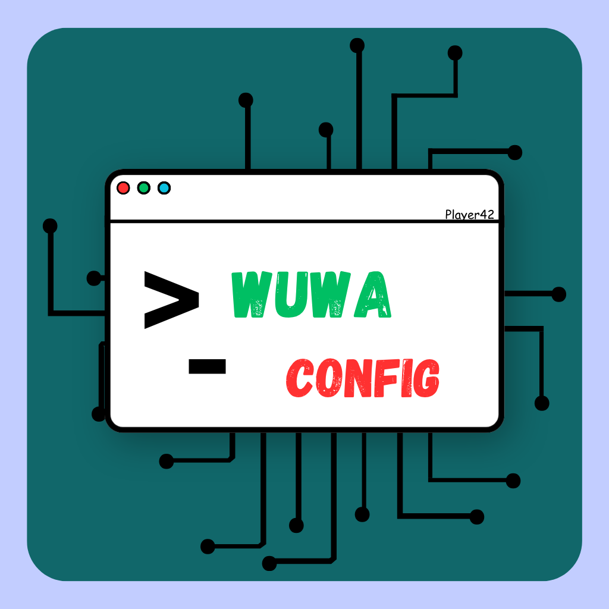
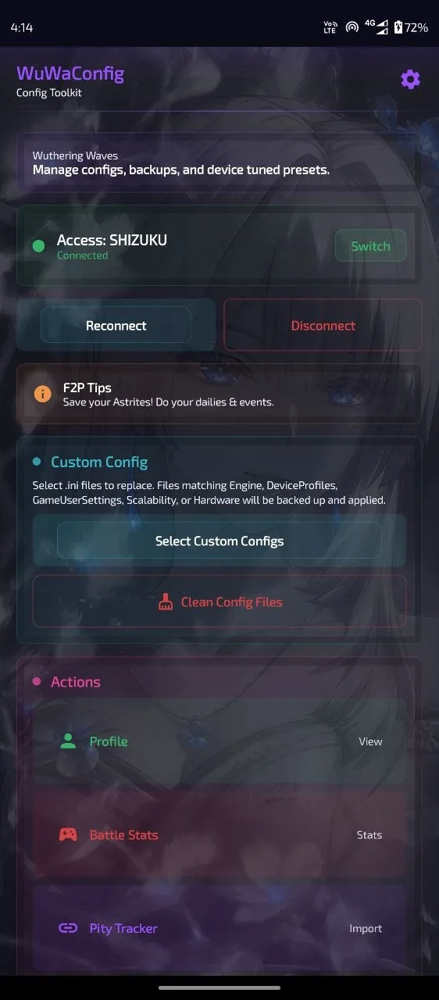
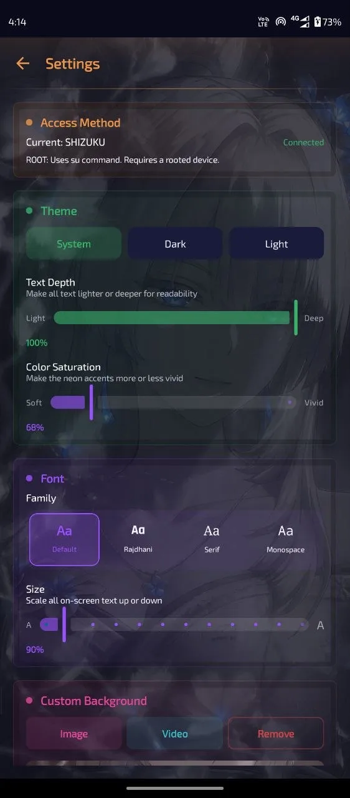
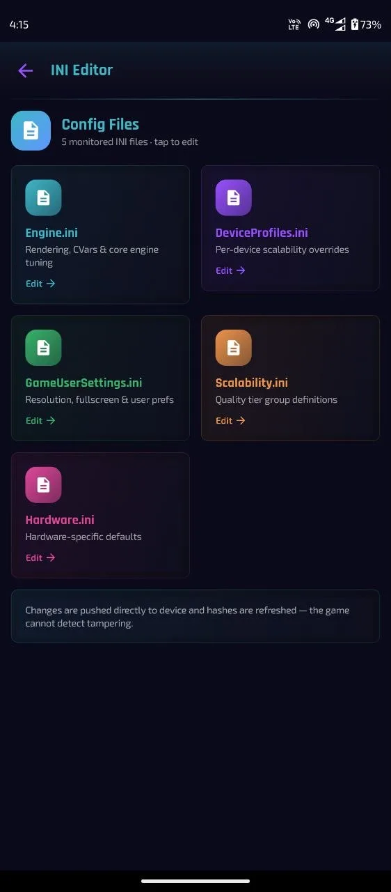
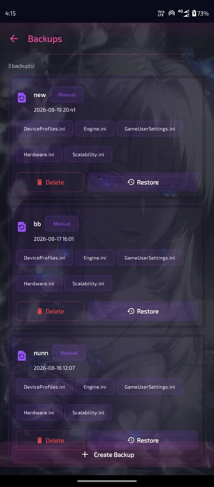
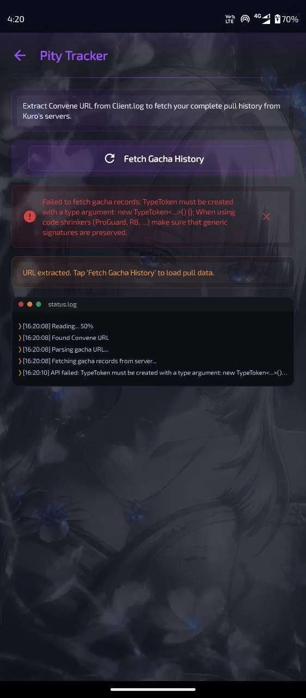
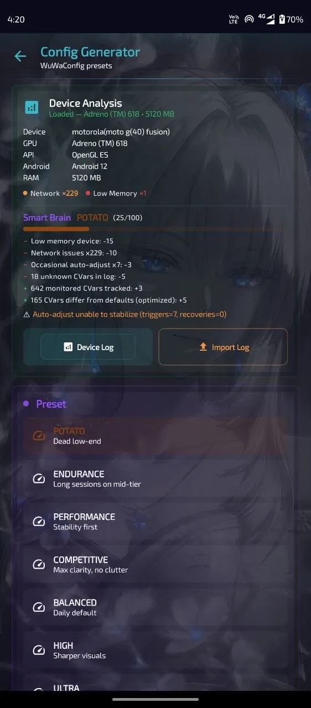

<div align="center">



# WuWaConfig

### Boost FPS · Tune Graphics · Analyze Device · Track Pity · Stay Private

[](https://github.com/B3rr7/WuWa-Config-Android/releases)
[](https://github.com/B3rr7/WuWa-Config-Android/stargazers)
[](https://developer.android.com)
[](https://kotlinlang.org)
[](https://github.com/B3rr7/WuWa-Config-Android)
[](LICENSE)

A free, open-source Android toolkit that generates, optimizes and deploys
Unreal Engine INI configs for Wuthering Waves — no root, no PC, no telemetry.

[Features](#features) • [Quick start](#quick-start) • [Backends](#backends) • [Presets](#presets) • [Build](#building-from-source) • [Architecture](#architecture)

</div>

---

> [!WARNING]
> **Disclaimer** — WuWaConfig is **not affiliated with or endorsed by Kuro Games or
> Wuthering Waves**. It is a fan-made tool for educational and research purposes.
> It edits local configuration files only: no code injection, no memory patching, no
> network protocol changes. Modifying game files may still fall under the game's
> Terms of Service. **Use at your own risk.**

> [!NOTE]
> **Android 8.0 (API 26) and newer only.** There is no iOS build, and a PC, Mac or
> Linux machine is not required — the app implements the ADB wire protocol itself.

---

## Features

- **Config generator** — Writes five INI files (`Engine.ini`, `Scalability.ini`,
  `GameUserSettings.ini`, `DeviceProfiles.ini`, `Hardware.ini`) tuned to your chipset
  across Snapdragon, Dimensity, Exynos and Tensor. Sets `FullscreenMode=0` to dodge the
  Android windowed-viewport bug.
- **SmartBrain device scoring** — A 0–100 score derived from GPU tier, RAM, resolution,
  Vulkan support, thermal behaviour and logged frame drops, mapped to a recommended preset.
- **8 quality presets** — `potato` → `cinematic`, each on its own detail rank. Every tier
  actually differs in screen percentage, shadow resolution, SSR, mip bias, streaming
  multiplier, view distance, foliage LOD, LOD bias and grass culling.
- **CVar database** — 5,889 engine CVars plus 735 monitored keys. Redundant, unknown and
  platform-dead CVars are commented out with a `; [CVarDB] <reason>` marker. A restricted
  mode strips 31 CVars known to destabilise this build.
- **Engine generation detection** — Reads the `++UE4+…` / `++UE5+…` banner out of
  `Client.log` and suppresses UE5-only CVars that are inert on a UE4 build.
- **Gacha pity tracker** — All 11 convene pools, no cap on tracked pulls, with
  guaranteed/50-50 state per banner and next-5★ prediction.
- **Battle stats & player profile** — Decrypts and parses `Client.log` for combat,
  dodge, movement and echo-skill figures, plus a read-only UID, server and tower readout.
- **Backup, restore & hash monitor** — Automatic pre-write backup, MD5 snapshot/reconcile
  to survive the game rewriting files under you, and one-tap restore.
- **INI editor & log viewer** — Monospace editor with line diff, search and pre-deploy
  hash verification; colour-coded log view with 5 MB rotation.
- **System agent surface** — 9 read-only [AppFunctions](#appfunctions) so an on-device
  assistant can query presets, analyse logs and read deploy history.

<p align="center">
  
  
  
  
  
  
</p>

---

## Quick start

1. Install the latest APK from [Releases](https://github.com/B3rr7/WuWa-Config-Android/releases)
   (Android 8.0+; allow *Install unknown apps* if prompted).
2. Open the app, accept the terms, and grant the storage permission it asks for.
3. Connect with one of the [backends](#backends) below.
4. Go to **Config Generator** → review the SmartBrain score → pick a preset → **Generate**.
5. **Review & Tune** shows the diff against the live files. Edit anything you want, then
   **Deploy**.

> [!TIP]
> Always deploy with the game closed. The hash monitor reconciles the game's own writes
> to the config directory, but a running client will simply overwrite parts of what you
> just pushed.

---

## Backends

The app reads and writes
`Android/data/com.kurogame.wutheringwaves.global/files/UE4Game/Client/Client/Saved/Config/Android`.
Pick the backend that fits your device:

| Backend | Shell | File push | Log reading | Config gen | Needs | Best for |
|:--|:--:|:--:|:--:|:--:|:--|--|
| **ADB** | Yes | Yes | Yes | Yes | Wireless debugging | Non-rooted, no PC |
| **Shizuku** | Yes | Yes | Yes | Yes | Shizuku service | Non-rooted with Shizuku |
| **Root** | Yes | Yes | Yes | Yes | `su` | Magisk / KernelSU / APatch |
| **SAF** | No | Yes | Limited | No | A folder grant | One-off edits, nothing else |

### ADB — wireless debugging, no PC

The ADB wire protocol is implemented in-process (`adb/AdbProtocol.kt`, 24-byte header,
RSA-2048 auth), so there is no `adb` binary and no PC in the loop.

1. Enable **Wireless debugging** in Developer options.
2. Tap **Connect** — the port scanner sweeps 37 000–44 000 plus 5555.
3. Accept the RSA fingerprint prompt on the device.

If you do have a PC, the classic route still works:

```bash
adb tcpip 5555
adb connect 192.168.1.42:5555
# tear it down when you're done
adb disconnect 192.168.1.42:5555
adb usb
```

> [!IMPORTANT]
> **Android 11+ and Chinese ROMs (Xiaomi/HyperOS, vivo, OPPO)** deny the `shell` user
> writes into `Android/data/`. A `Permission denied` triggers an automatic `run-as` retry.
> If the game is not debuggable, the retry cannot work — switch to **?** or **Root**.

### Shizuku — Binder IPC

Install [Shizuku](https://shizuku.rikka.app/), start the service, then select **Shizuku →
Permit → Connect**. The app talks to a `ShellUserService` over Shizuku's UserService API,
with a script-file fallback for payloads over 4096 characters.

> [!TIP]
> If Shizuku reports a bind timeout, enable **USB debugging (Security settings)** alongside
> regular USB debugging and re-authorize it. Several ROMs patch Shizuku's
> `makeApplicationInner()`; `RomBackgroundSettings` in-app walks you through the fix.

### Root — `su -c`

Select **Root → Test Root**, grant the prompt, then **Connect**. Root is the only backend
that is fully reliable inside `Android/data/` on Android 11+.

### SAF — Storage Access Framework

Select **SAF → Pick Dir** and grant the game's tree. The picker opens pre-targeted at
`Android/data/com.kurogame.wutheringwaves.global`, which Android 11+ otherwise hides.

> [!NOTE]
> SAF is file-level only — there is no shell. Log reading and the config generator are
> unavailable on this backend by design; it exists for direct, hand-made edits.

---

## Presets

Each preset sits on a distinct detail rank, so no two tiers emit identical output.

| Preset | Detail | Screen % | Shadow | Shadow res | SSR | Mip bias | Streaming | View dist | Foliage LOD | LOD bias | Grass cull |
|---|--:|--:|--:|--:|--:|--:|--:|--:|--:|--:|--:|
| **potato** | 0 | 60% | 0 | 128 | 0 | 3 | 0.3× | 0.3 | 0.4 | 5 | 1 500 |
| **endurance** | 1 | 70% | 0 | 128 | 0 | 3 | 0.4× | 0.4 | 0.5 | 4 | 2 500 |
| **performance** | 2 | 60% | 0 | 256 | 0 | 3 | 0.5× | 0.5 | 0.6 | 3 | 4 500 |
| **competitive** | 3 | 100% | 2 | 256 | 0 | 1 | 1.0× | 2.0 | 1.0 | 1 | 2 000 |
| **balanced** | 4 | 80% | 2 | 1 024 | 1 | 0 | 2.0× | 1.5 | 2.0 | 0 | 15 000 |
| **high** | 5 | 100% | 4 | 2 048 | 2 | 0 | 3.0× | 2.0 | 2.5 | 0 | 20 000 |
| **ultra** | 6 | 100% | 5 | 2 048 | 4 | −1 | 4.0× | 3.0 | 3.0 | −1 | 30 000 |
| **cinematic** | 7 | 100% | 5 | 4 096 | 4 | −2 | 6.0× | 4.0 | 4.0 | −2 | 40 000 |

**Toggles:** 120 FPS unlock, ultra-quality unlock, VSync, auto-cooling, forced Vulkan,
HZB occlusion, per-feature disables (fog, chromatic aberration, outlines, motion blur,
bloom, auto-exposure, SSR), `Hardware.ini` generation from the detected chipset, and
GameMode (Overworld / Tower of Adversity).

The full option surface is documented in
[docs/CONFIG-GENERATOR.md](docs/CONFIG-GENERATOR.md).

---

## Troubleshooting

| Symptom | Fix |
|---|---|
| FPS below target | Drop screen % to 60–80%, shadows to 0–2, check `r.FramePace.MaxFPS` |
| Phone throttling | Set `ReflectionEnvironment=0`, cut dynamic lights and volumetric fog, enable auto-cooling |
| GPU out of memory crash | Shadow `MaxResolution` 1024, anisotropy 4, `PoolSize` 512, no HD texture packs |
| Missing or broken textures | Enable `r.HZBOcclusion=1`, mip bias 0–1, raise `PoolSize`, verify DeviceProfiles |
| Stutter / uneven pacing | Lower render scale if CPU-bound, disable VSync, cap MaxFPS to 60 or 120 |
| Exynos or Mali underperforming | Start one tier below the Snapdragon equivalent; lower shadow and streaming quality |
| 120 FPS will not unlock | Enable the toggle, verify `r.FramePace.MaxFPS=120`, ensure thermal headroom |
| Post-process artefacts | Post-process 0–2, bloom 0–1, disable auto-exposure, reduce radial blur |
| `Permission denied` on deploy | Use the `run-as` fallback, or switch to **SAF** / **Root** |
| Wireless debugging won't connect | Same network as the target, re-enable wireless debugging, check the firewall |
| Shizuku denied on a Chinese ROM | Enable *USB debugging (Security settings)*, re-authorize Shizuku |

---

## Building from source

**Requirements:** JDK 17, Android SDK with **platform 37** installed. Gradle itself is
provided by the wrapper (9.6.0).

```bash
git clone https://github.com/B3rr7/WuWa-Config-Android.git
cd WuWa-Config-Android

./gradlew ktlintCheck        # style gate (CI enforces this)
./gradlew lint               # Android Lint
./gradlew testDebugUnitTest  # 30 pure-logic test classes
./gradlew assembleDebug      # app/build/outputs/apk/debug/WuWaConfig-debug.apk
```

Run the four in that order before opening a PR — that is the same order CI uses.

> [!IMPORTANT]
> **Release signing has no fallback keystore, on purpose.** `assembleRelease` fails with an
> explicit `GradleException` unless *all four* of `storeFile`, `storePassword`, `keyAlias`
> and `keyPassword` are present — via `keystore.properties` at the repo root (gitignored)
> or the `STORE_FILE` / `STORE_PASSWORD` / `KEY_ALIAS` / `KEY_PASSWORD` environment
> variables. A silently-signed APK would pass UpdateManager's certificate check and get
> offered to every user.

Debug builds use the `applicationIdSuffix = ".debug"`, so they get their own storage and
preferences and are correctly refused by UpdateManager against a release install — and the
other way around.

> [!NOTE]
> `compileSdk` **37 is a hard floor**, not a preference: `android.app.appfunctions` exists
> only in android-37's `android.jar`, and dropping back to 36 breaks `kspDebugKotlin`.
> `targetSdk` stays 36. After changing any version in `gradle/libs.versions.toml`, refresh
> the dependency pin file:
>
> ```bash
> ./gradlew --write-verification-metadata sha256 help
> ```
>
> `gradle/verification-metadata.xml` is committed and mandatory; without it the build fails.

### Tech stack

| Area | Choice |
|---|---|
| Language | Kotlin 2.2.20, JDK 17, AGP 9.4.0, KSP 2.3.12 |
| UI | Jetpack Compose, Material 3, BOM 2026.04.01 |
| Navigation | Navigation 3 (`navigation3-runtime` / `-ui` 1.1.7), type-safe `@Serializable` route keys |
| Architecture | MVVM — 8 `AndroidViewModel`s + `StateFlow`, service-locator `Application` |
| Async | kotlinx-coroutines 1.11.0 |
| Media | Coil 3.3.0, Media3 ExoPlayer 1.7.1 |
| Security | Platform `AndroidKeyStore` (AES-256-GCM), Shizuku UserService, DocumentFile |
| Serialization | Gson 2.13.2, kotlinx-serialization (nav keys) |
| Agents | `androidx.appfunctions` 1.0.0-alpha11 |
| SDK | min 26 · target 36 · compile 37 |
| Quality | ktlint 12.1.0 · Android Lint · JUnit 4.13.2 · Mockito 5.11.0 |

---

## Architecture

```
WuWaConfigApp (Application)  — service locator, no DI framework
├── AccessBackend ──┬── AdbBackend      wire protocol, base64 chunked push, run-as fallback
│                   ├── ShizukuBackend  ShellUserService Binder IPC, script-file fallback
│                   ├── RootBackend     su -c
│                   └── SafBackend      DocumentFile, persistable tree URI
├── CvarDatabase    5,889 CVars, async-loaded from assets
├── ConfigGenerator 8 presets → 5 INIs
└── LogRepository   ring buffer, 1 000 entries

MainActivity — single Activity, Navigation 3
├── 14 type-safe destinations (nav/Destinations.kt)
└── 8 ViewModels (all Activity-scoped)
    └── Screens → Components → Theme
```

<details>
<summary><b>Source tree — all 87 Kotlin files</b></summary>

```
app/src/main/java/com/wuwaconfig/app/
│
├── MainActivity.kt               the single Activity; NavDisplay, entryProvider, transitions
├── WuWaConfigApp.kt              Application — service locator, backend, CvarDatabase, generator
│
├── adb/                          the ADB wire protocol, implemented in-process (no PC daemon)
│   ├── AdbProtocol.kt            24-byte header, CRC32, frame encode/decode, typed failures
│   ├── AdbClient.kt              TCP transport, RSA auth handshake, 15s heartbeat, run-as wrapper
│   ├── AdbCrypto.kt              RSA-2048 keypair generation and the adb public/private key files
│   ├── AdbKeyVault.kt            AES-256-GCM at rest, keyed by the platform AndroidKeyStore
│   └── PortScanner.kt            sweeps 37 000–44 000 + 5555, banner sniffing, 30s IP cache
│
├── backend/                      the four ways to reach the game's files
│   ├── AccessBackend.kt          AccessMethod enum, BackendStatus, the interface itself
│   ├── AdbBackend.kt             base64-chunked push over AdbClient, run-as fallback on denial
│   ├── ShizukuBackend.kt         Shizuku UserService IPC, 60s timeout, script-file fallback
│   ├── RootBackend.kt            su -c, 10s timeout
│   ├── SafBackend.kt             DocumentFile over a persistable tree URI — no shell
│   └── ShellUtils.kt             shQuote, computeMd5, runAsCommand, PUSH_RETRY_COUNT
│
├── config/                       generation, analysis, persistence
│   ├── ConfigGenerator.kt        PresetProfile, the 8 PRESETS, the 5 INI builders
│   ├── ConfigGenUtil.kt          dedupe, entry parsing, CVar overrides, dead-CVar marking
│   ├── ConfigManager.kt          facade over BackupStore / ProfileExtractor / HashMonitor
│   ├── CvarDatabase.kt           5,889 CVars from assets, optimizeIniText rewriter
│   ├── CvarCategorizer.kt        3-level prefix/substring matching → 19 categories
│   ├── CvarOptimizer.kt          GPU-tier regex → tuned profile for the current device
│   ├── CvarPlatformScope.kt      OS × API-level × engine-generation CVar applicability
│   ├── ForbiddenCvars.kt         31 unstable CVars, stripped in restricted mode
│   ├── SmartBrain.kt             0–100 device score → recommendPreset()
│   ├── LogParser.kt              XOR-LUT decrypt, UTF-16/8 detect, battle stats, gacha URLs
│   ├── ProfileExtractor.kt       reads/decodes Client.log, verifies deployed CVars
│   ├── HashMonitor.kt            KuroConfigMonitor MD5s, atomic patch, concurrent-write detect
│   ├── HashSync.kt               one shared device hash-sync check for deploy + editor
│   ├── IniHashUtil.kt            extractHash() — pulls one file's hash out of the monitor file
│   ├── BackupStore.kt            backup CRUD, backup/public dirs, Client.log persistence
│   ├── GachaApi.kt               convene history fetch, 11 pools, pity computation
│   ├── GachaHistoryStore.kt      gacha_history.json, 12h TTL
│   ├── DeployHistoryStore.kt     deploy_history.json, 20 records
│   ├── ProfileStore.kt           player_profile.json
│   └── ChipsetDetector.kt        Snapdragon / MediaTek / Exynos / Tensor identification
│
├── model/                        data classes, stores and the log buffer
│   ├── PresetModels.kt           GameMode, CvarEntry, GeneratorOptions (29 fields), GeneratedIni
│   ├── GamePaths.kt              every on-device path the app touches, in one place
│   ├── LogInfo.kt                device facts parsed out of the log banner
│   ├── LogEntry.kt               LogLevel, LogEntry
│   ├── LogRepository.kt          1 000-entry ring buffer + credential redaction
│   ├── LogAnalysisStore.kt       cached_log_analysis.json, 24h TTL
│   ├── PlayerProfile.kt          read-only UID, server, level, tower
│   ├── BattleStats.kt            combat, dodge, movement, echo-skill figures
│   ├── BattleStatsStore.kt       cached_battle_stats.json, 24h TTL
│   ├── ConfigHashInfo.kt         per-file MD5 snapshot
│   ├── ConfigPreset.kt           ConfigFile, ConfigBackup
│   ├── DeployRecord.kt           DeployRecord, DeployComparison
│   ├── GachaRecord.kt            GachaPoolType (11 pools), GachaData, pity state
│   └── VerificationReport.kt     CvarCategory (19), CvarDetail, VerificationReport
│
├── nav/                          Navigation 3
│   ├── Destinations.kt           14 @Serializable NavKey objects, ALL_DESTINATIONS, startDestination
│   ├── NavigationState.kt        wraps a single rememberNavBackStack
│   └── Navigator.kt              the only code allowed to mutate the back stack
│
├── service/
│   ├── AdbConnectionService.kt   dataSync foreground service holding the ADB socket
│   └── ShellUserService.kt       Binder hosted by Shizuku's UserService process
│
├── appfunctions/                 system-agent surface
│   ├── BaseWuWaAppFunctionService.kt   9 @AppFunction entry points
│   └── AppFunctionModels.kt            the deliberately reduced @AppFunctionSerializable DTOs
│
├── ui/
│   ├── MainViewModel.kt          primary shared state holder
│   ├── DeployHistoryViewModel.kt deploy + verify coordination
│   ├── BackupViewModel.kt        backup CRUD and directory prefs
│   ├── GachaViewModel.kt         pity tracker
│   ├── ProfileViewModel.kt       player profile
│   ├── LogInsightsViewModel.kt   log analysis, SmartBrain, battle stats
│   ├── IniEditorViewModel.kt     editor document, search, diff
│   ├── SettingsViewModel.kt      theme, prefs, update state, C# env probe
│   ├── DeviceOps.kt              app-scoped mutex serializing every device-touching operation
│   ├── components/Components.kt  GlassCard, GlassButton, GradientBackground, GlitchText, LogViewer
│   ├── theme/
│   │   ├── Color.kt              single immutable neon palette behind one state holder
│   │   ├── Theme.kt              Material 3 schemes, edge-to-edge, dynamic colour
│   │   └── Type.kt               Rajdhani, serif and monospace families + Typography
│   └── screens/                  14 screens
│       ├── SetupScreen.kt            onboarding
│       ├── TermsScreen.kt            terms of use
│       ├── UserGuideScreen.kt        local HTML guide in a WebView
│       ├── HomeScreen.kt             connection status, quick actions, SAF picker
│       ├── ConfigGenScreen.kt        preset selection and generation
│       ├── ReviewTuneScreen.kt        diff, inline edit, deploy
│       ├── IniEditorScreen.kt         full-screen monospace editor with search
│       ├── BackupScreen.kt           backups and restore
│       ├── HistoryScreen.kt          deploy history
│       ├── PityScreen.kt             gacha pity tracker
│       ├── ProfileScreen.kt          player profile
│       ├── BattleStatsScreen.kt      battle stats
│       ├── LogsScreen.kt             colour-coded log viewer
│       └── SettingsScreen.kt         preferences, theme, updates
│
├── util/
│   ├── LineDiff.kt           DiffLine/DiffResult, LineDiff.compute, Hashing.md5Of
│   ├── AtomicFile.kt         temp + fsync + rename(2), so a crash can't truncate a store
│   ├── LocalOnlyImage.kt     asserts a Coil URI is a content:// the user picked
│   ├── SensitiveClipboard.kt clipboard copies marked EXTRA_IS_SENSITIVE
│   └── RomBackgroundSettings.kt  deep-links the ROM's background-process settings
│
├── update/UpdateManager.kt   GitHub release check; refuses an APK whose cert differs
│
└── assets/cvars/              libUE4_cvars.txt (5,889) + config_monitor_{cvars,values}.txt (735 each)
```

</details>

### Notable design decisions

- **Navigation 3 over Navigation 2.** The former string routes are now `@Serializable`
  `NavKey` objects, so a typo in `navigate()` is a compile error rather than a silent no-op.
  `DestinationsTest` pins each key's serial name: `rememberNavBackStack` persists the stack
  through saved state, so renaming a key would break back-stack restore across an update.
- **All 8 ViewModels are hoisted to `MainActivity`.** `navigation3-runtime` ships no
  per-entry `ViewModelStoreOwner` decorator, so `viewModel()` inside an `entry` would
  silently fall through to the Activity anyway — this makes the scope explicit.
- **A separate Shizuku `UserService` process.** `WuWaConfigApp.onCreate()` therefore runs
  twice: once in the app, once as uid 2000 with none of the app's storage reachable. An
  `isUserServiceProcess()` guard returns before any bootstrap; anything thrown above that
  guard makes Shizuku's binder bind time out with no diagnostic.
- **The CVar optimizer is a rewriter, not a validator.** Every line it touches is left in
  place with a `; [CVarDB] <reason>` comment, so a deploy is always inspectable and
  reversible rather than silently lossy.

### AppFunctions

`BaseWuWaAppFunctionService` exposes nine read-only functions to system agents —
`listPresets`, `generateConfig`, `getDeviceProfile`, `recommendPreset`, `analyzeGameLog`,
`getCachedLogAnalysis`, `getCachedBattleStats`, `getDeployHistory`, `getDeployOutcome`.
KSP generates the service subclass and its assets schema at compile time.

Inspect the surface on a connected device:

```bash
adb shell cmd app_function list-app-functions

adb shell cmd app_function execute-app-function \
  --package com.wuwaconfig.app.debug \
  --function 'com.wuwaconfig.app.appfunctions.BaseWuWaAppFunctionService#listPresets'
```

> [!NOTE]
> The service is `exported="true"` by necessity — the system is the caller — and gated by
> `android:permission="BIND_APP_FUNCTION_SERVICE"`. Device-mutating operations are
> deliberately *not* exposed: they need a live backend session, and several would destroy
> unrecoverable state. The account identifier in battle stats and the bearer token in
> gacha history are withheld from the DTOs.

---

## Privacy & security

- **No telemetry.** No Firebase, Crashlytics or Sentry. The app never contacts a server
  you did not initiate a request to.
- **Local-only network.** `network_security_config.xml` permits cleartext to
  `127.0.0.1` / `localhost` only. Gacha history is broadcast in-process via
  `LocalBroadcastManager`.
- **Keys encrypted at rest.** ADB key material is written through an
  `AndroidKeyStore` AES-256-GCM key (`AdbKeyVault`). The deprecated
  `androidx.security:security-crypto` dependency survives only so that Tink blobs written
  by older releases stay readable — an unreadable key would silently rotate the user's ADB
  identity and force a fresh RSA authorisation.
- **Backups disabled.** `allowBackup="false"`, so nothing is extractable through Android
  backup.
- **Permission-gated providers.** `ShizukuProvider` is locked behind
  `INTERACT_ACROSS_USERS_FULL`. This is a Shizuku requirement, not an oversight:
  `ShizukuProvider.call()` performs no caller check of its own, and without the attribute
  any installed app could walk away with the live Shizuku binder.
- **Hardened release build.** R8 with `isShrinkResources`; `Log.d` / `Log.v` are stripped
  and the keep rules are narrowed to what reflection actually needs.

---

## Community

- [GitHub](https://github.com/B3rr7/WuWa-Config-Android) — issues and releases
- [Website](https://b3rr7.github.io/WuWa-Config-Android/)
- [YouTube — Player42](https://www.youtube.com/@Player42_g)
- [Telegram](https://t.me/Yt_Player42) · [Discord](https://discord.gg/5WP9nN2e2s)

Issues and bug reports are the most useful contribution — device model, ROM, backend in
use, and the exact error text go a long way.

---

<div align="center">

**Made for Rovers — by Rovers.**

[Back to top](#wuwaconfig)

</div>
